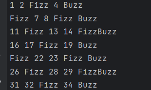

# FizzBuzz Spring Boot CLI Application

This repository contains a simple **FizzBuzz** application built with **Spring Boot** using the **CommandLineRunner** interface.  


---
## Features

- Demonstrates basic usage of `CommandLineRunner`
- Implements the classic FizzBuzz logic:
    - Prints **"Fizz"** for multiples of 3
    - Prints **"Buzz"** for multiples of 5
    - Prints **"FizzBuzz"** for multiples of both 3 and 5
    - Prints the number itself otherwise
- Outputs results grouped with 5 elements per line

---

## Screenshot



---

## How to Run

Make sure you have Java and Maven installed.

1. Clone the repository:
   ```bash
   git clone https://github.com/Muhammedeness/FizzBuzz.git


2. Build the project:
  ```bash
   mvn clean package -DskipTests

  ```
3. Run the project:
  ```bash
   java -jar target/booting-0.0.1-SNAPSHOT.jar
